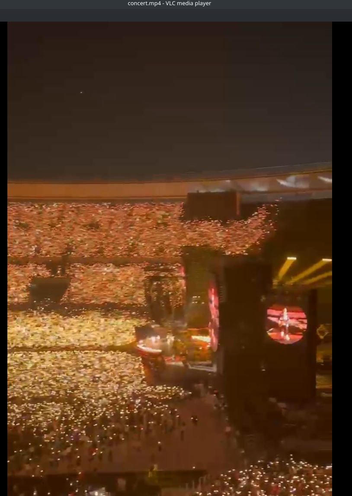
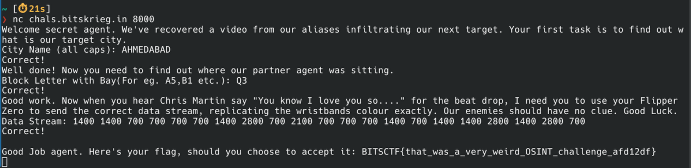

# Hot Pause - BITSCTF 2025

### Category: OSINT

This challenge presented an MP4 fan-video from a concert and a question/answer bot. The first question was about the city name in which the recording was made. I did not have a clue what this concert was so I started with google image search with a frame from the video. The results were suggesting Coldplay and I sort of lucky guessed it's the song "Yellow". 

I then started searching youtube for live Coldplay concerts in stadiums and found another fanmade short video with matching colours, this one was titled "Narendra Modi" which quickly led me to the city name: `AHMEDABAD`.

The next question required a specific seat from where the provided video was recorded. Knowing the stadium name I found it's seating diagram online and guessed the right spot at the 3rd attempt: `Q3`. It was possible by observing the location of entrances and where the main stage was situated.

https://stadiumsguide.com/wp-content/uploads/2023/09/narendra-modi-stadium-seating-plan-rows-stands-982x1024.jpg

The third question was suprising, but fun. The task was to stop the video at specific moment and observe the colour of the wristbands. The question was a specific code sequence that is used to drive the color of these wristbands using e.g. a Flipper Zero. I never owned one but I quickly found a github repo where reverse engineered colour sequences are defined for pretty much all variations of colours. 

https://github.com/danielweidman/flipper-pixmob-ir-codes/blob/main/PixMob_main.ir

I initially thought it's about White, but conquering a massive brain fart I decided it has to be ... Yellow. And it worked, revealing the flag after these 3 questions.

